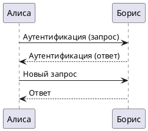

# Диаграммы PlantUML

## docsify-plantuml

> Источник: https://github.com/imyelo/docsify-plantuml

Плагин позволяет размещать диаграммы внутри MD-статьи (код диаграммы необходимо указывать непосредственно в разметке). По умолчанию для генерации используется сервер PlantUML (https://www.plantuml.com/plantuml), но при необходимости можно указать собственный адрес сервера.

### Простой пример



### Пример Pay API


``` plantuml
autonumber "<font color=red><b>[00]"
actor Пользователь as User
box Кошелёк #plum
	participant "Приложение\nКошелёк" as Wallet
	participant "Сервер\nКошелёк Pay API" as CMPAY
end box
box Партнёр #lightblue 
	participant "Касса и ЦОД ТСП" as POS
end box

User->POS: Выкладка товаров к покупке
User->Wallet: Выбор карты лояльности в Кошельке
Wallet->POS: Штрихкод карты лояльности
POS->POS: - Сканирование товаров.\n- Считывание из Кошелька номера карты лояльности. \n- Проверка доступности оплаты через Кошелёк Pay\n (в ШК содержится //cardSession//). \n- Валидация парольной части. \n- Идентификация покупателя по //loyaltyId//.\n- Расчет суммы.  
POS->POS: Кассир выполняет закрытие чека на кассе

alt ШК содержит //cardSession//
POS->CMPAY: <back:gold>**[Кошелёк Pay API]**</back> **POST** /availability-info/task\nЗапрос списка возможных провайдеров платежей
alt HTTP Status Code = 200
 CMPAY-->POS: Список провайдеров платежей
else HTTP Status Code = 201
CMPAY-->POS: //availabilityInfoId, timeout//
loop Запрос списка провайдеров платежей до получения результата
POS->CMPAY: <back:gold>**[Кошелёк Pay API]**</back> **GET** /availability-info/{availabilityInfoId}\nПолучение списка доступных провайдеров платежей
CMPAY-->POS: Список провайдеров платежей
end loop

end
else ШК не содержит //cardSession//
POS->POS: Оплата "Кошелёк Pay"\nне подключена у покупателя
note over POS
Стандартный сценарий оплаты (карта, наличные)
end note
end

opt#Gold #LightBlue Расчет скидок и бонусов
POS->POS: Обращение к ЦОД ТСП\nдля расчета скидок и бонусов 
POS->POS: Получение скидок и\nбонусов от ЦОД ТСП
POS->POS: Формирование итоговой\nсуммы платежа
end
```